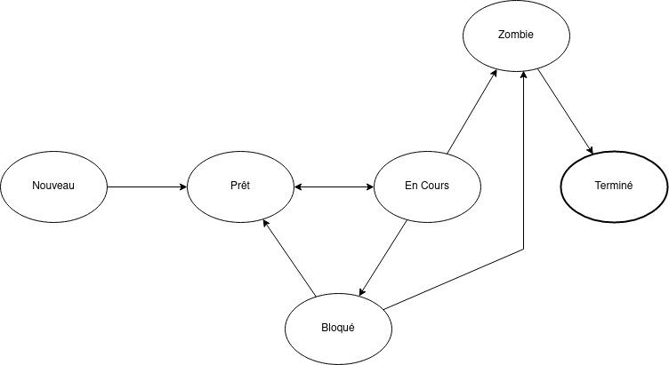

# FILASSe

FILASSe also known as Filasse Isn't Like Another Scheduler System.

## Introduction
FILASSe is a thread Scheduler written in Rust. 

His automaton scheme is :  

## Documentation
To check the documentation, clone this repository and run `cargo doc` in the root path of the project.

## Contributing
TBD

## License

Licensed under either of

* Apache License, Version 2.0
  ([LICENSE-APACHE](LICENSE-APACHE) or http://www.apache.org/licenses/LICENSE-2.0)
* MIT license
  ([LICENSE-MIT](LICENSE-MIT) or http://opensource.org/licenses/MIT)

at your option.

The [SPDX](https://spdx.dev) license identifier for this project is `MIT OR Apache-2.0`.

Unless you explicitly state otherwise, any contribution intentionally submitted
for inclusion in the work by you, as defined in the Apache-2.0 license, shall be
dual licensed as above, without any additional terms or conditions.
